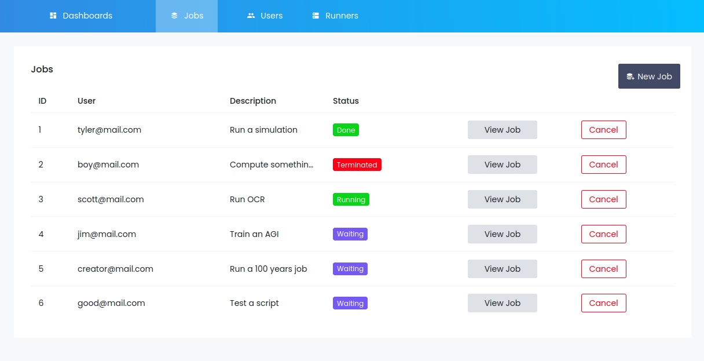

# ⚠️ No longer maintained

# Broker


Broker was created as a tool for a team of 9 ML practitioners to manage their 
access to a single GPU machine. The idea was to avoid running multiple jobs at
once (which would cause OOM errors), and to have a dashboard to visualize the 
jobs and their respective states.

According to Wikipedia:
> A broker's prime responsibility is to bring sellers and buyers together and 
> thus a broker is the third-person facilitator between a buyer and a seller.

In the same way, the global architecture of the system was designed around the
Scheduler, the API that connects users with runners. 

<p align="center">
  
</p>

Theoretically, the system could scale to multiple runners. But has yet to be
tested.

## Install
### Scheduler
To install the Scheduler on the main host machine (API + Dashboard):

Use docker-compose to build the two images
```
$ docker-compose -f docker/docker-compose-dev.yml build
```

And run the app:
```
$ docker-compose -f docker/docker-compose-dev.yml up
```

You can either use the Web UI ...

<p align="center">
  
</p>

... or the bash script `broker` for command line usage.

### Runners
Runners are single file python scripts, that you can run directly on your
python env or on a docker container using `docker/runner-dev.Dockerfile`.
The only dependancy is `requests`.

```
$ cd runner
$ python runner.py --scheduler_ip [IP] --scheduler_port [PORT]
```

## Caveats
This is my first time writing an API / doing web dev. This is a development
version that has no security at all. 

## Aknowledgements
The dashboard uses this template 
<https://github.com/BootstrapDash/StarAdmin-Free-Vue-Admin-Template>

